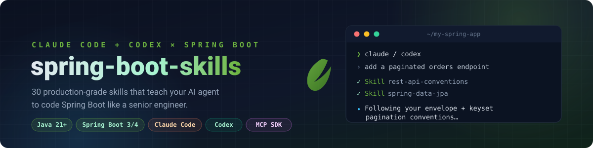
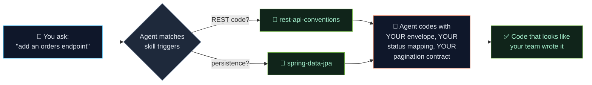

<div align="center">



<br/>
<br/>

**Production-grade Spring Boot skills for Claude Code and Codex. Drop a skill into your project and your AI coding agent instantly understands your architecture, patterns, and conventions.**

<br/>

[](skills/)
[](https://spring.io/projects/spring-boot)
[](https://openjdk.org/)
[](LICENSE)

[](https://code.claude.com)
[](https://chatgpt.com/codex)
[](https://spring.io/projects/spring-ai)
[](https://github.com/modelcontextprotocol/java-sdk)
[](https://github.com/rrezartprebreza/spring-boot-skills/stargazers)

<br/>

[**Quick Start**](#-quick-start) · [**Skills Catalog**](#-skills) · [**Before / After**](#-before--after) · [**Skill Anatomy**](#-skill-anatomy) · [**Contributing**](#-contributing)

</div>

---

## Why this exists

AI coding agents are great at Python. They hallucinate in Spring Boot.

They generate `@Autowired` field injection instead of constructor injection. They use `ResponseEntity<?>` where you have a standard response wrapper. They ignore your existing exception hierarchy and invent a new one. They don't know your project uses Flyway, so they generate schema SQL by hand. They emit pre-GA Spring AI artifact names that no longer exist in Maven Central.

**Skills fix this.** A skill is a markdown file your agent reads before touching your code. It tells the agent *your* conventions, your stack, your gotchas — not generic Spring Boot from 2020.



This repo is a collection of battle-tested skills. Copy, adapt, drop in.

---

## 🧠 Concepts

| Concept | Description |
|---------|-------------|
| **Skills** | Markdown files loaded into Claude Code or Codex context — tell the agent *how* to work in your codebase |
| **CLAUDE.md / AGENTS.md** | Project-level persistent memory — your agent's onboarding doc |
| [**MCP Java SDK**](https://github.com/modelcontextprotocol/java-sdk) | Official Java SDK for building MCP servers — connect your Spring Boot app to any AI agent |
| **Marketplace plugins** | Versioned Claude Code and Codex packages for all Boot 3 or Boot 4 skills |
| **Project templates** | Ready-to-adapt `CLAUDE.md` and `AGENTS.md` guidance for Boot 3 and Boot 4 projects |
| **Planned workflows** | Repeatable commands such as `/generate-endpoint`, `/write-test`, and `/db-migrate` are listed in the roadmap |

---

## 📦 Skills

The catalog ships in **two version trees** — pick the folder that matches your stack. Shared topics
normally have both flavors; genuinely version-specific topics may live only in the relevant tree.

| Folder | Target stack | Compatibility baseline |
|--------|--------------|-----------------------|
| [`skills/spring-boot-4/`](skills/spring-boot-4/) | Spring Boot 4.x · Spring Framework 7 · Spring Security 7 · Spring Batch 6 · Jackson 3 · Spring AI 2.0 | Java 17+; examples use Java 21; Boot 4.0.x and 4.1.x |
| [`skills/spring-boot-3/`](skills/spring-boot-3/) | Spring Boot 3.x · Spring Framework 6 · Spring Security 6 · Spring Batch 5 · Jackson 2 · Spring AI 1.x | Java 17+; examples use Java 21 |

Drop any skill folder into your agent's skills directory. Claude Code users can copy them to `.claude/skills/`; Codex users can adapt the same `SKILL.md` folders for `.codex/skills/`.
The catalog below links to the **Spring Boot 4** versions — swap `spring-boot-4` for `spring-boot-3` in any path if you're still on Boot 3.

The version guidance follows the [Spring Boot 4 system requirements](https://docs.spring.io/spring-boot/system-requirements.html), the [Spring Boot 4 migration guide](https://github.com/spring-projects/spring-boot/wiki/Spring-Boot-4.0-Migration-Guide), and [Spring AI's compatibility guidance](https://docs.spring.io/spring-ai/reference/getting-started.html). Check the official release notes before upgrading a project.

Fast-moving integrations were last verified in August 2026 against Spring Boot 4.1, Spring AI 2.0,
MCP Java SDK 2.0, Spring Cloud 2025.1, and Spring Cloud Gateway 5.0. Keep BOM-managed dependency
versions together and recheck the linked official sources before adopting a newer release line.

### 🏗️ Architecture

| Skill | Description | Tags |
|-------|-------------|------|
| [**layered-architecture**](skills/spring-boot-4/layered-architecture/) | Enforces Controller → Service → Repository separation. Prevents business logic leaking into controllers or repositories. | `architecture` |
| [**hexagonal-architecture**](skills/spring-boot-4/hexagonal-architecture/) | Ports and adapters pattern for Spring Boot. Keeps domain clean of framework dependencies. | `architecture` `ddd` |
| [**domain-driven-design**](skills/spring-boot-4/domain-driven-design/) | Aggregates, value objects, domain events with commit-safe publication. Includes JPA mapping conventions. | `ddd` `jpa` |
| [**multi-module-maven**](skills/spring-boot-4/multi-module-maven/) | Parent POM conventions, shared BOM, inter-module dependency rules. Prevents circular deps. | `maven` `architecture` |
| [**multi-tenancy**](skills/spring-boot-4/multi-tenancy/) | Tenant resolution, database/schema isolation, tenant-aware persistence, caches, jobs, and migrations. | `architecture` `security` `data` |

### 🔌 API Design

| Skill | Description | Tags |
|-------|-------------|------|
| [**rest-api-conventions**](skills/spring-boot-4/rest-api-conventions/) | Your project's response envelope, error codes, pagination contract, versioning strategy. Fill in the template. | `rest` `api` |
| [**openapi-first**](skills/spring-boot-4/openapi-first/) | Generate controllers and DTOs from OpenAPI spec. Uses `openapi-generator-maven-plugin`. | `openapi` `codegen` |
| [**problem-details-rfc9457**](skills/spring-boot-4/problem-details-rfc9457/) | RFC 9457 compliant error responses with Spring's `ProblemDetail`. Replaces ad-hoc error envelopes. | `error-handling` `rest` |
| [**hateoas**](skills/spring-boot-4/hateoas/) | Spring HATEOAS link building conventions. Teaches agent when and how to add hypermedia links. | `hateoas` `rest` |

### 🌐 Edge & Reactive

| Skill | Description | Tags |
|-------|-------------|------|
| [**spring-cloud-gateway**](skills/spring-boot-4/spring-cloud-gateway/) | Secure route design, header hygiene, timeouts, rate limits, retries, and release-train compatibility. | `gateway` `spring-cloud` `security` |
| [**webflux-reactive-patterns**](skills/spring-boot-4/webflux-reactive-patterns/) | Non-blocking WebFlux, Reactor context, R2DBC, backpressure, cancellation, and reactive tests. | `webflux` `reactor` `r2dbc` |

### 🗄️ Data & Persistence

| Skill | Description | Tags |
|-------|-------------|------|
| [**spring-data-jpa**](skills/spring-boot-4/spring-data-jpa/) | Boot 4 JPA with Hibernate 7: entity modeling, Jakarta imports, relationships, projections, N+1 prevention, keyset pagination, and batch writes. | `jpa` `hibernate` |
| [**flyway-migrations**](skills/spring-boot-4/flyway-migrations/) | Migration naming convention, safe multi-step schema changes, team workflow for concurrent migrations. | `flyway` `migrations` |
| [**spring-data-redis**](skills/spring-boot-4/spring-data-redis/) | Cache-aside pattern, key naming, TTL strategy, stampede protection, serialization config. | `redis` `caching` |
| [**transactional-patterns**](skills/spring-boot-4/transactional-patterns/) | `@Transactional` propagation rules, self-invocation pitfall, after-commit side effects, saga pattern. | `transactions` |

### 📨 Messaging

| Skill | Description | Tags |
|-------|-------------|------|
| [**event-driven-messaging**](skills/spring-boot-4/event-driven-messaging/) | Kafka/RabbitMQ/Pulsar/JMS contracts, idempotent consumers, outbox delivery, retries, and dead letters. | `messaging` `kafka` `rabbitmq` |

### ⚙️ Batch & Jobs

| Skill | Description | Tags |
|-------|-------------|------|
| [**spring-batch**](skills/spring-boot-4/spring-batch/) | Spring Batch 6 chunk jobs, JDBC versus resourceless repositories, `JobOperator`, restartability, reader sort/thread-safety, and transaction boundaries. | `batch` `etl` |

### 🚀 Migration & Deployment

| Skill | Description | Tags |
|-------|-------------|------|
| [**spring-boot-migration**](skills/spring-boot-4/spring-boot-migration/) | Staged Boot 3.5 → 4 migration covering modular starters, Jackson 3, tests, servers, and verification. | `migration` `spring-boot-4` |
| [**container-native-deployment**](skills/spring-boot-4/container-native-deployment/) | Buildpacks, layered OCI images, JVM containers, GraalVM native images, AOT hints, and probes. | `containers` `graalvm` `aot` |

### 🧰 Framework 7 Core

| Skill | Description | Tags |
|-------|-------------|------|
| [**api-versioning**](skills/spring-boot-4/api-versioning/) | Spring Framework 7 built-in API versioning: mapping versions, central request resolution, defaults, supported versions, and deprecation headers. | `rest` `api` `versioning` |
| [**http-interface-clients**](skills/spring-boot-4/http-interface-clients/) | Boot 4 declarative HTTP clients with `@ImportHttpServices`, grouped base URLs/timeouts, and RestClient versus WebClient selection. | `http` `clients` |
| [**null-safety**](skills/spring-boot-4/null-safety/) | JSpecify nullability for Framework 7: `@NullMarked`, `@Nullable`, generic and array positions, Kotlin interop, and NullAway. | `null-safety` `jspecify` |
| [**resilience-retry**](skills/spring-boot-4/resilience-retry/) | Framework 7 core `@Retryable` and `@ConcurrencyLimit`: enablement, backoff, no `@Recover`, proxy, and transaction pitfalls. | `resilience` `retry` |

### 🔒 Security

| Skill | Description | Tags |
|-------|-------------|------|
| [**spring-security-jwt**](skills/spring-boot-4/spring-security-jwt/) | JWT auth filter chain, access and refresh token validation, RBAC with method security. Opinionated starting point. | `security` `jwt` |
| [**oauth2-resource-server**](skills/spring-boot-4/oauth2-resource-server/) | OAuth2 resource server config, JWT claim extraction, scope-based authorization. | `security` `oauth2` |

### 🤖 AI & MCP

| Skill | Description | Tags |
|-------|-------------|------|
| [**spring-ai-integration**](skills/spring-boot-4/spring-ai-integration/) | Spring AI ChatClient, chat memory, RAG pipeline, structured output. Real GA artifact names — no dead pre-GA coordinates. | `spring-ai` `llm` |
| [**mcp-server**](skills/spring-boot-4/mcp-server/) | Build MCP servers with the Java SDK 2.x and Spring AI 2.0 native annotations. Tool registration, Streamable HTTP, and stdio safety. | `mcp` `ai-agents` |
| [**ai-observability**](skills/spring-boot-4/ai-observability/) | Token usage tracking, latency monitoring, prompt/response logging for Spring AI apps. | `observability` `spring-ai` |

### 📊 Operations

| Skill | Description | Tags |
|-------|-------------|------|
| [**production-observability**](skills/spring-boot-4/production-observability/) | Actuator, Micrometer, OpenTelemetry/OTLP, health probes, structured logging, and actionable alerts. | `actuator` `micrometer` `opentelemetry` |

### 🧪 Testing

| Skill | Description | Tags |
|-------|-------------|------|
| [**testing-pyramid**](skills/spring-boot-4/testing-pyramid/) | Unit → Slice → Integration conventions. `@WebMvcTest`, `@DataJpaTest`, `@MockitoBean`, Testcontainers. | `testing` |

---

## ⚡ Quick Start

**1. Prepare your coding agent**

Install Claude Code if needed:
```bash
npm install -g @anthropic-ai/claude-code
```

If you use Codex, confirm the CLI or desktop app command is available:
```bash
codex --version
```

**2. Drop a skill into your project**

Claude Code:
```bash
PROJECT_DIR=/path/to/my-spring-app
mkdir -p "$PROJECT_DIR/.claude/skills"
# Spring Boot 4 project
cp -r skills/spring-boot-4/rest-api-conventions "$PROJECT_DIR/.claude/skills/"
cp -r skills/spring-boot-4/spring-data-jpa "$PROJECT_DIR/.claude/skills/"

# Spring Boot 3 project — same skills, Boot 3 flavor
cp -r skills/spring-boot-3/rest-api-conventions "$PROJECT_DIR/.claude/skills/"
```

Codex:
```bash
PROJECT_DIR=/path/to/my-spring-app
mkdir -p "$PROJECT_DIR/.codex/skills"
# Spring Boot 4 project
cp -r skills/spring-boot-4/rest-api-conventions "$PROJECT_DIR/.codex/skills/"
cp -r skills/spring-boot-4/spring-data-jpa "$PROJECT_DIR/.codex/skills/"

# Spring Boot 3 project — same skills, Boot 3 flavor
cp -r skills/spring-boot-3/rest-api-conventions "$PROJECT_DIR/.codex/skills/"
```

Run these commands from the root of this repository, or replace `skills/` with the path to your
local clone.

For persistent project guidance, start from the matching templates:

```bash
# Codex, Spring Boot 4
cp templates/spring-boot-4/AGENTS.md "$PROJECT_DIR/AGENTS.md"

# Claude Code, Spring Boot 4
cp templates/spring-boot-4/CLAUDE.md "$PROJECT_DIR/CLAUDE.md"
```

Boot 3 equivalents live under `templates/spring-boot-3/`. Adapt commands and conventions to the
project rather than using the templates unchanged.

### Install from the Claude Code marketplace

This repository also exposes two marketplace plugins without duplicating the skill files:

```bash
claude plugin marketplace add rrezartprebreza/spring-boot-skills
claude plugin install spring-boot-4-skills@spring-boot-skills
# or for a Boot 3 project:
claude plugin install spring-boot-3-skills@spring-boot-skills
```

The marketplace manifest is [`.claude-plugin/marketplace.json`](.claude-plugin/marketplace.json).
Validate it locally with `claude plugin validate .`. The repository can be submitted to Anthropic's
[Claude Code community marketplace](https://platform.claude.com/plugins/submit); approval is a
separate review step. GitHub Marketplace is intended for GitHub Apps and Actions, so this skills
repository should use GitHub releases and the Claude marketplace instead.

### Install as a Codex plugin

Codex uses its own plugin manifest and marketplace catalog. Add this repository and install the
version that matches your application:

```bash
codex plugin marketplace add rrezartprebreza/spring-boot-skills
codex plugin add spring-boot-4-skills@spring-boot-skills
# or for a Boot 3 project:
codex plugin add spring-boot-3-skills@spring-boot-skills
```

The Codex package metadata lives in [`.agents/plugins/marketplace.json`](.agents/plugins/marketplace.json)
and the two plugin manifests under [`plugins/`](plugins/). Direct copying into `.codex/skills/`
remains supported for projects that do not use plugins.

**3. Tell your agent what you want**
```
claude
> Generate a CRUD endpoint for the Order entity following our REST conventions
```

or:

```
codex
> Generate a CRUD endpoint for the Order entity following our REST conventions
```

That's it. Your agent reads the skill before writing a single line.

---

## ⚔️ Before / After

The value of these skills is not generic Spring Boot advice. The value is preventing the small mistakes AI agents make when they do not know your backend conventions.

<table>
<tr>
<th>❌ Without a skill</th>
<th>✅ With <code>layered-architecture</code> + <code>rest-api-conventions</code></th>
</tr>
<tr>
<td>

```java
@RestController
public class OrderController {
    @Autowired
    private OrderRepository repository;

    @PostMapping("/orders")
    public ResponseEntity<?> create(
            @RequestBody Order order) {
        return ResponseEntity.ok(
            repository.save(order));
    }
}
```

</td>
<td>

```java
@RestController
@RequestMapping("/api/v1/orders")
@RequiredArgsConstructor
class OrderController {
    private final OrderService orderService;

    @PostMapping
    ResponseEntity<ApiResponse<OrderResponse>> create(
            @Valid @RequestBody CreateOrderRequest request) {
        OrderResponse response = orderService.create(request);
        return ResponseEntity.status(HttpStatus.CREATED)
            .body(ApiResponse.ok(response));
    }
}
```

</td>
</tr>
<tr>
<td>

- Business logic leaks into the controller
- No request DTO or validation boundary
- Repository called directly from the web layer
- Response shape ignores project conventions
- Status codes left to framework defaults

</td>
<td>

- Controller as a pure HTTP adapter
- Service owns the business rules
- DTO validation at the boundary
- Consistent response envelope
- Correct `201 Created` semantics

</td>
</tr>
</table>

---

## 📐 Skill Anatomy

Every skill in this repo follows the same structure:

```
skills/spring-boot-4/rest-api-conventions/
├── SKILL.md          ← the skill: trigger description + conventions + gotchas
├── agents/
│   └── openai.yaml   ← Codex skill-list metadata and default prompt
├── examples/         ← good and bad examples, side by side
│   ├── good-controller.java
│   └── bad-controller.java
└── templates/        ← copy-paste starting points
    ├── ApiResponse.java
    └── GlobalExceptionHandler.java
```

**SKILL.md** has two critical parts:

```markdown
---
name: rest-api-conventions
description: >
  Use when generating REST controllers, response objects, DTOs, or error handlers.
  Defines the project's response envelope, HTTP status mapping, and error code conventions.
---

## Conventions
...
```

The `description` is a **trigger** — write it as "use when [condition]", not as a summary. This is what makes the agent actually load the skill.

The **Gotchas** section at the bottom of each skill is the secret weapon: a running list of the exact mistakes agents make in that domain, phrased as `Agent does X — do Y instead`.

---

## 💡 Tips from the trenches

**The Gotchas section is the most valuable part** — add to it every time the agent does something wrong. Your future self will thank you.

**Don't describe what Spring Boot already knows.** Skills should push your agent *out of* its default behavior, not repeat the docs.

**Be opinionated about your project.** Generic Spring Boot best practices belong in a blog post. Skills belong in your agent skills folder.

**Fork this repo and customize.** Every team's conventions are different. These are starting points, not gospel.

**Combine with CLAUDE.md or AGENTS.md.** Project guidance stores build commands, verification, and architecture decisions. Skills provide reusable domain-specific workflows.

| Anti-pattern | Fix |
|--------------|-----|
| Giant SKILL.md with everything | Split into focused skills, one concern each |
| "Always use constructor injection" | Already a strong agent default — skip it |
| No examples | Add a `good.java` and `bad.java` — the contrast is what teaches |
| Prescriptive step-by-step instructions | Give goals and constraints, let agent decide how |
| Never updating | Add a Gotchas section, update it when agent fails |

---

## 🔥 Hot: MCP Server Skill

The [`mcp-server`](skills/spring-boot-4/mcp-server/) skill is the most powerful one here.

It teaches your agent to build production-ready MCP servers on **MCP Java SDK 2.x** and the
**Spring AI 2.0 starters** - the same protocol used by Claude, Codex, Cursor, VS Code, and other
major AI coding tools.

The MCP skill distinguishes native MCP annotations such as `@McpTool` from Spring AI model
tool-calling annotations such as `@Tool`. Use the native MCP path when exposing server tools.

```java
// What the agent generates with the skill loaded —
// real GA API: spring-ai-starter-mcp-server + annotation scanning
@Component
public class OrderMcpTools {

    private final OrderService orderService;

    @McpTool(name = "get_order",
             description = "Get a single order by ID including all line items and status history")
    public OrderResponse getOrder(
            @McpToolParam(description = "UUID of the order", required = true) String orderId) {
        return OrderResponse.from(orderService.findById(UUID.fromString(orderId)));
    }
}
```

Without the skill, the agent guesses: dead pre-GA artifact names, removed SDK constructors,
`@Tool` instead of native `@McpTool`, or `System.out` logging that corrupts stdio transport.

---

## 🗺️ Roadmap

- [x] Skills for Spring Batch
- [x] Spring Boot 4 versions of all 30 skills (`skills/spring-boot-4/`)
- [x] Skills for Spring Cloud Gateway
- [x] Skills for Spring WebFlux / reactive patterns
- [x] Skills for multi-tenancy
- [x] Spring Boot 3 → 4 migration skill
- [x] Production observability skill
- [x] Event-driven messaging skill
- [x] Container and native deployment skill
- [x] CLAUDE.md and AGENTS.md templates for Boot 3 and Boot 4
- [ ] `/generate-endpoint` command
- [ ] `/write-test` command
- [ ] `/db-migrate` command
- [ ] Integration with [Hatch](https://github.com/rrezartprebreza/hatch) background job library
- [ ] Integration with [SpringPulse](https://github.com/rrezartprebreza/springpulse) observability

---

## 🤝 Contributing

Skills get better with real-world use. If you find a gap — the agent did something stupid in your Spring Boot project — open a PR and add it to the Gotchas section of the relevant skill.

Before opening a PR, run:

```bash
bash scripts/validate-skills.sh
```

The validation script checks both version trees, front matter, README catalog paths, and required
skill sections.

```
1. Fork the repo
2. Copy an existing skill as a template
3. Fill in conventions, examples, gotchas
4. PR with a one-line description of what problem it solves
```

---

## 🛠️ More from the same workbench

| Repo | Description |
|------|-------------|
| [**Hatch**](https://github.com/rrezartprebreza/hatch) | Multi-module background job library for Spring Boot — REST polling, retry, Redis/JDBC backends, SSE dashboard |
| [**SpringPulse**](https://github.com/rrezartprebreza/springpulse) | Runtime observability for `@Scheduled` methods — AOP interception, WebSocket dashboard |
| [**rest-api-generator**](https://github.com/rrezartprebreza/rest-api-generator) | CLI that scaffolds Spring Boot REST APIs from plain English prompts |

---

<div align="center">

**If a skill saved your agent from writing `@Autowired` field injection today — ⭐ star the repo.**

<br/>

`spring-boot` · `java` · `claude-code` · `codex` · `mcp` · `spring-ai` · `skills` · `developer-tools`

<br/>

*Built by [@rrezartprebreza](https://github.com/rrezartprebreza) · Pristina, Kosovo*

<br/>

[LinkedIn](https://www.linkedin.com/in/rrezartprebreza/)

</div>
